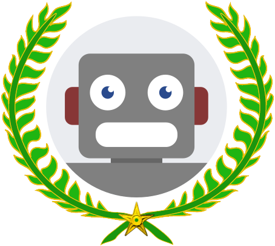

# Heficience Bot

 

  

## Un bot Discord  

Fonctionalités du bot :  

__I - FONCTIONNALITÉS COOL :__  
------------------------------
   1 - Toute personne qui commence son message par hello, bonjour, bonsoir, coucou, hey et salut aura la réaction : 👋 à son message.  
   2 - La commande "**!jitsi**" envoit en réponse un message contenant un lien unique vers la plateforme jitsi.

__II - ADMINISTRATION DU SERVEUR :__    
------------------------------------
   1 - Enregistrement des nouveaux arrivants sur un fichier json (l'utilisation d'un fichier permet en cas de coupure du bot même temporaire de ne pas réinitialiser la liste des nouveaux utilisateurs).  
   2 - Prévenir les Administrateurs et les Modérateurs du Serveur Discord quand les nouveaux arrivants sont là depuis plus de 24h, afin de vérifier qu'ils ont bien respecté les règles d'accès au(x) différent(s) statut(s).  
   3 - Afin de contrôler les liens postés par tout les intervenants du serveur par l'équipe d'Administration, une copie des messages contenant un lien internet sera transmis en MP aux Administrateurs et aux Modérateurs.  
   4 - Afin de faciliter la gestion et la communication du serveur, tout message portant la mention @Administrateurs enverra une copie de ce dernier envoyée en MP aux Administrateurs et aux Modérateurs.

__III - GESTION DES TÂCHES ET COMPÉTENCES :__  
---------------------------------------------  

   1 - La commande  

   __**!tache**__  suivi des instructions liées à la tâche

   dans le salon **#💼-taches**,  

   ouvrira une tâche dans ce même salon (attention seul les admins peuvent lancer la commande). Ensuite, les personnes intéressées par la tâche peuvent :  
- Soit utiliser la réaction avec l'émoji 👌 pour accepter la tâche.  
- Soit utiliser la réaction avec l'émoji 👍 afin de signaler avoir terminée la tâche.  
- Soit utiliser la réaction avec l'émoji 👎 afin de signaler avoir abandonnée la tâche.   

Une fois avoir réagit avec 👍 les émojis pour choisir l'état de la tâche disparaissent, si vous l'avez fait par erreur ou si simplement vous voulez relancer la tâche, il faudra allez chercher manuellement l'émoji de réaction voulue.  

   2 - Dans le salon **#⌨-langage-connu**  
   le clic sur chaque émoji correspondant au langage que vous maîtrisez vous donnera le rôle langage untel ou untel :  
- Langage assembleur   
- Langage C    
- langage C++ (Cpp)   
- Langage C# (C Sharp)   
- Langage CSS   
- Langage HTML   
- Langage Java 
- Langage JavaScript 
- Langage LUA 
- Langage php 
- Langage Python 
- Bibliothèques Qt (pour C++ ou Python) 

__IV - PRISE DE DÉCISIONS :__  
------------------------------
   1 - Les commandes suivantes en début de message permettent les votes :  

    !yes/no : ajoute 3 réactions : OUI, NON et ABSTENTION.

    !n1-n2 : ajoute des numéros de n1 à n2 en réaction pour QCM où n1 et n2 sont des nombres à deux chiffres et n1 ≥ 0, n2 ≤ 10 et n1 ≤ n2.
    Par exemple :
      !00-09 : ajoute des numéros de 0 à 9 en réaction.
      !01-10 : ajoute des numéros de 1 à 10 en réaction.
      !04-08 : ajoute des numéros de 4 à 8 en réaction.
